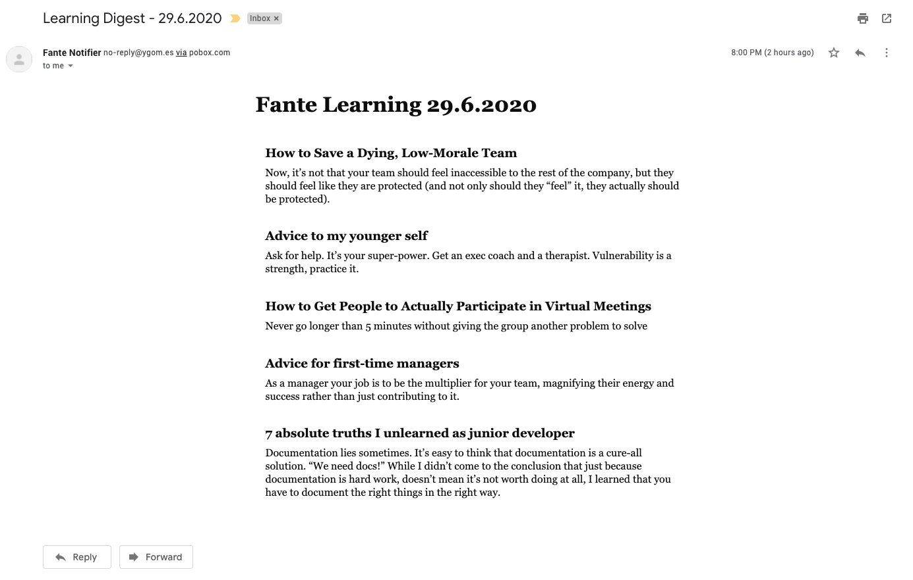
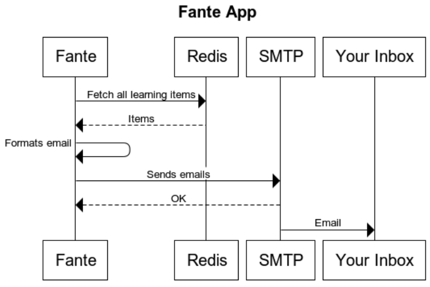

# Fante App

A simple application to help learners never forget a thing

## What does it do?

Fante works by sending you a email digest with quotes from your favorite books, articles or simply things you want to remember along your life.

This digest can be set up to be sent daily or anytime you need.

The idea behind this applications is that it will help you remember good things that you want to keep in memory but your brain simply doesn't help.

Early version sample email


## Sequence Diagram



## How to run ?

Pre-built base images are stored on [DockerHub](https://hub.docker.com/r/yurifariasg/fante) and can be used as a starting point. You still need to supply a configuration file for it to work.

```Dockerfile
FROM yurifariasg/fante:latest
COPY configs.js configs.js
```

Then, after built:

```
docker build -t fante
```

You can run it:

```
docker run fante
```

## Configuration

The configuration needed for this app looks like this:

```javascript
module.exports = {
  mail: {
    host: "smtp.myserver.com",
    port: 587,
    user: "user@email.com",
    pass: "password",
    from: '"Fante Notifier" <no-reply@example.com>',
    to: ["your@email.com"],
  },
  redis: {
    host: "localhost",
    port: 6379,
    password: "password",
  },
};
```

## Setting up periodically executions

This application works best when executed periodically. One way to do it is by setting it up on a simple machine that is always online at your home (example: RaspberryPi), and set up a cronjob to always run this application.

```
0 20 * * * docker run fante
```

This will execute fante everyday at 8pm.
